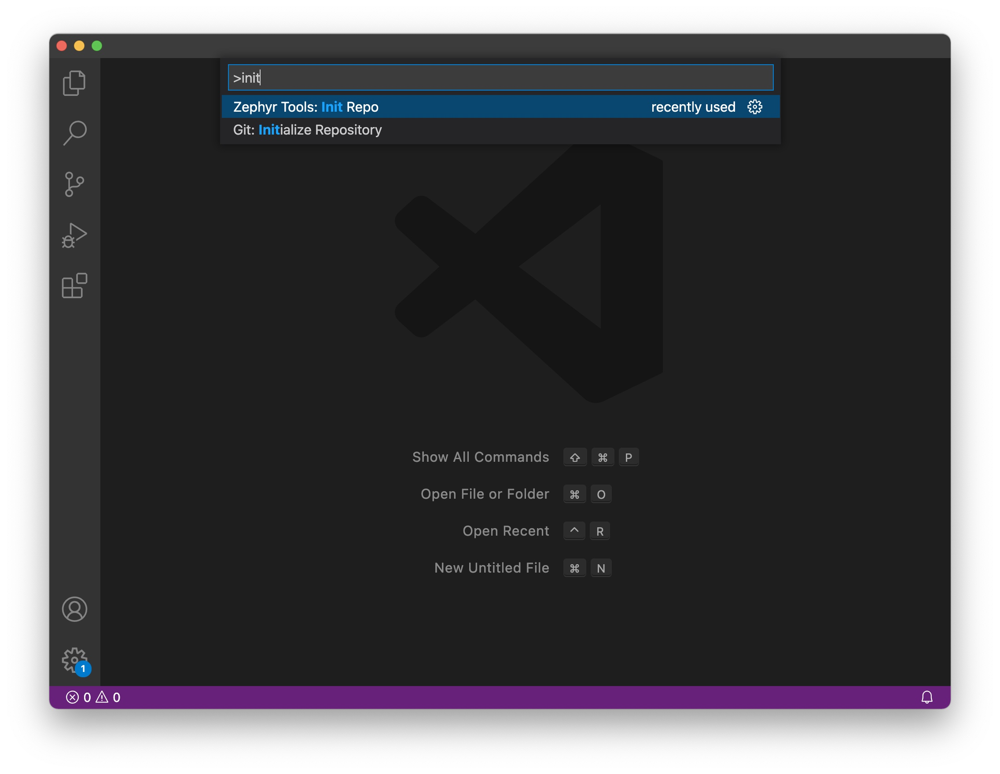
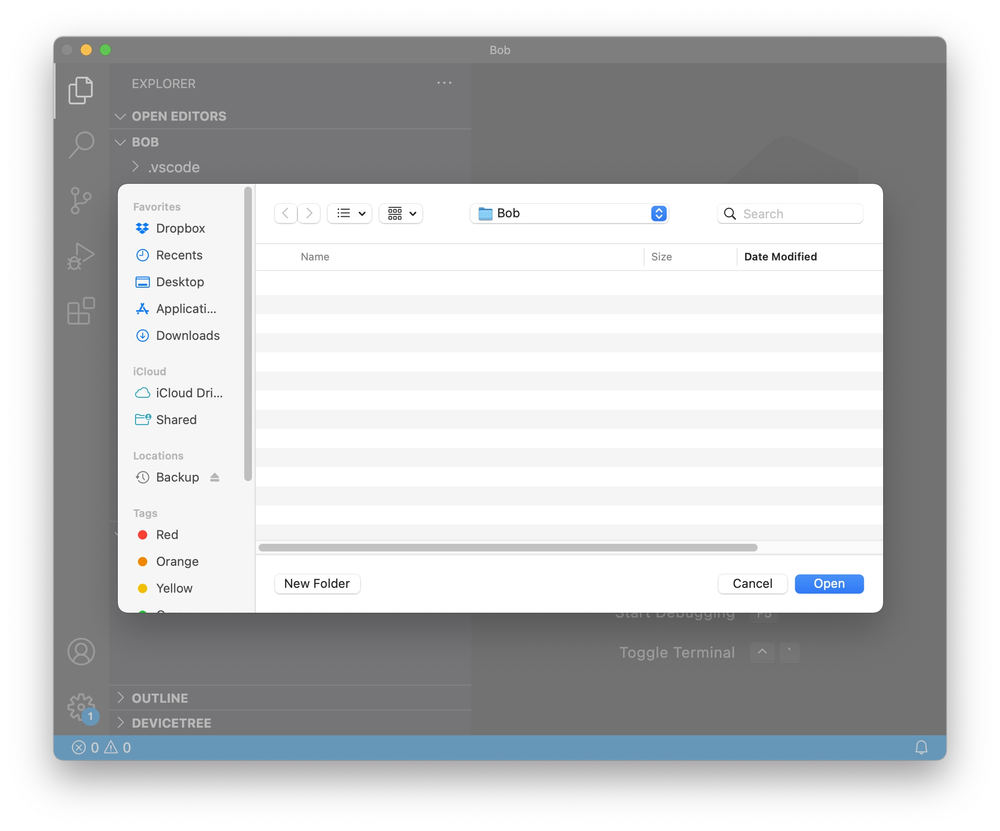
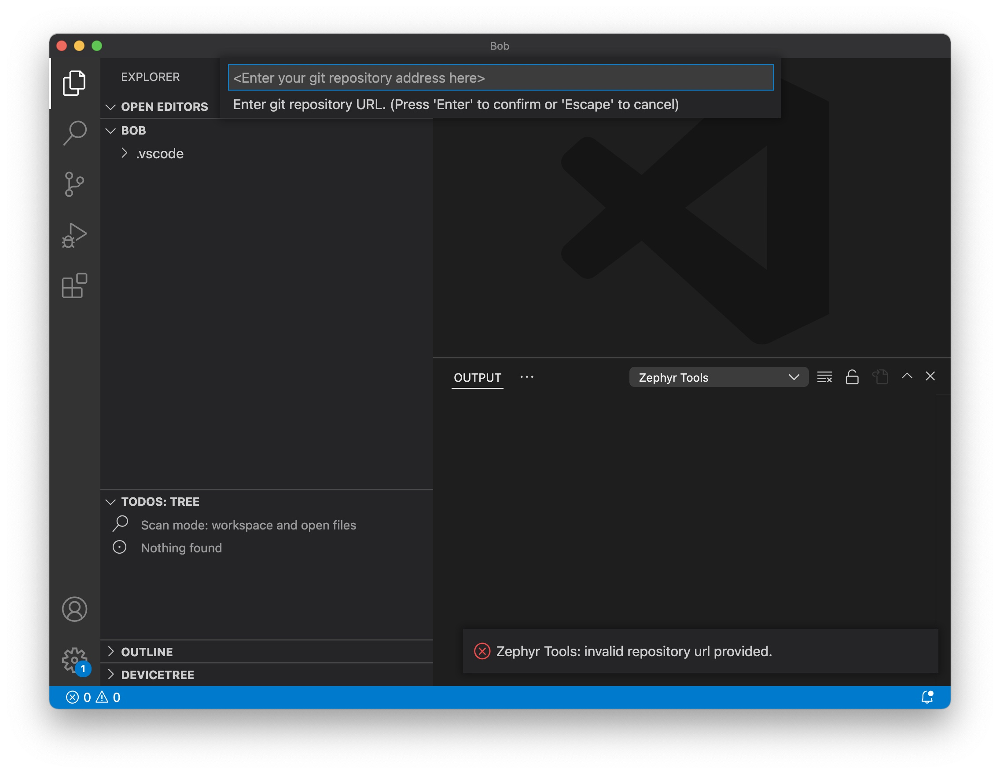
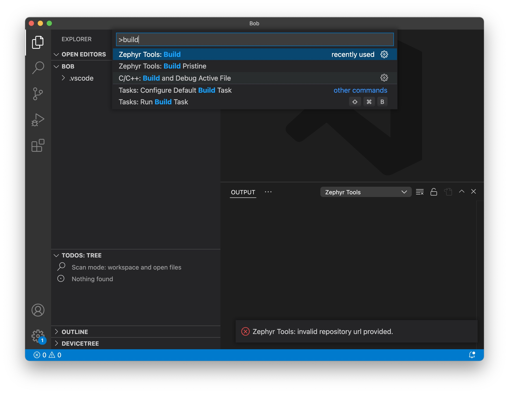

# Circuit Dojo - Zephyr Template

## Create your own project

1. Use this template!

   Click the green "Use this template" on [https://github.com/circuitdojo/zephyr-template/](https://github.com/circuitdojo/zephyr-template/)

2. Initialize your new project using Zephyr Tools in VSCode:

   

   

   

   This will download and initilize all important Zephyr dependencies and ARM toolchain.

## Building

Building can be done using the **Zephyr Tools: Build** or **Zephyr Tools: Build Pristine** command:

On first run, you will be prompted for the board name and the project that you'd like to build.

## More info

For more information, check out the Circuit Dojo documentation at [docs.jaredwolff.com](https://docs.jaredwolff.com)

## License

Apache 2.0. See `LICENSE` for more info.
